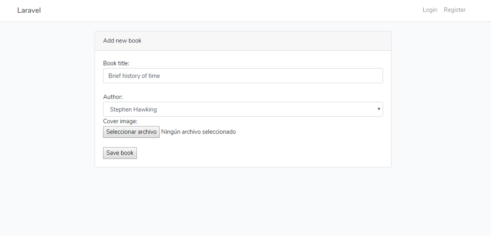
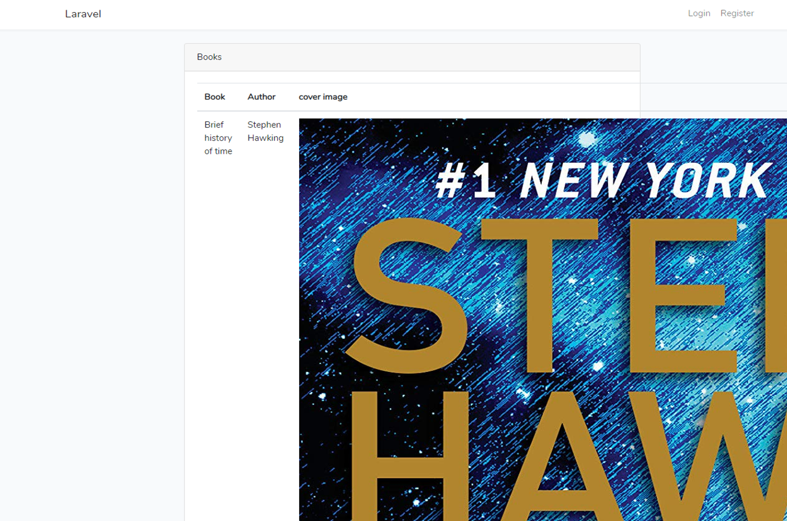
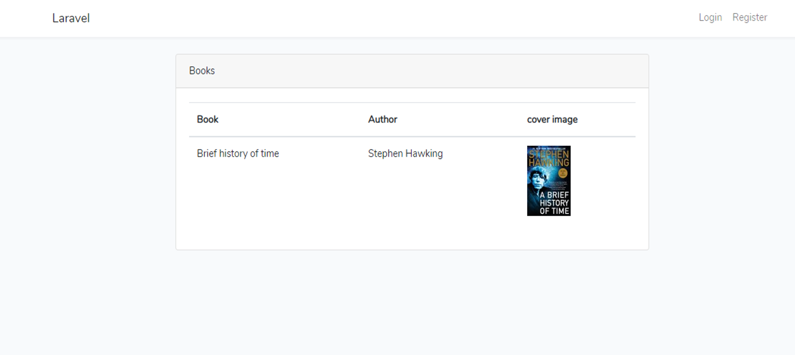

# Class Curriculum - laraveldaily (26 Dec 2018)

## Eloquent Model Options and Settings
 - [Artisan Command make:model with (hidden) options](#artisan-command-makemodel-with-hidden-options)
 - [Singular or Plural? What about multiple words?](#singular-or-plural-what-about-multiple-words)
 - [Saving a Model: $fillable or $guarded?](#saving-a-model-fillable-or-guarded)
 - [Properties for Tables, Keys, Increments, Pages and Dates](#properties-for-tables-keys-increments-pages-and-dates)

## Create/Update in Eloquent
 -  ["Magic" methods: FirstOrCreate() and other 2-in-1s](#magic-methods-firstorcreate-and-other-2-in-1s)
 -  [Model Observers: "listening" to record changes](#model-observers-listening-to-record-changes)
 -  [Accessors and Mutators: Change Model Values](#accessors-and-mutators-change-model-values)
 -  [Database Seeds and Factories: Prepare Dummy Data](#database-seeds-and-factories-prepare-dummy-data)
 -  [Seeds and Factories with Relationships](#seeds-and-factories-with-relationships)
 -  [Check Methods/Properties in Eloquent API Docs](#check-methodsproperties-in-eloquent-api-docs)

## Querying and Filtering Data Effectively
 -  [Advanced find() and all(): Methods and Parameters](#advanced-find-and-all-methods-and-parameters)
 -  [WhereX Magic Methods for Fields and Dates](#wherex-magic-methods-for-fields-and-dates)
 -  [Brackets to Eloquent: (A and B) or (C and D)](#brackets-to-eloquent-a-and-b-or-c-and-d)
 -  [Query Scopes: Where Conditions Applied Globally](#query-scopes-where-conditions-applied-globally)
 -  [Eloquent when(): More Elegant if-statement](#eloquent-when-more-elegant-if-statement)
 -  [Ordering by Relationship: orderBy vs sortBy](#ordering-by-relationship-orderby-vs-sortby)
 -  [Raw Database Queries with Examples](#raw-database-queries-with-examples)

## Eloquent Collections and their Methods
 - [Why You Need Collections and How to Use Them](#why-you-need-collections-and-how-to-use-them)
 - [Methods for Fetching and Transforming](#methods-for-fetching-and-transforming)
 - [Methods for Filtering with Callbacks](#methods-for-filtering-with-callbacks)
 - [Methods for Math Calculations](#methods-for-math-calculations)
 - [Methods for Debugging](#methods-for-debugging)
|

## Advanced Eloquent Relationships
 - [Polymorphic Relations Explained](#polymorphic-relations-explained)
 - [Polymorphic Many-to-Many Relations](#polymorphic-many-to-many-relations)
 - [Advanced Pivot Tables in Many-to-Many](#advanced-pivot-tables-in-many-to-many)
 - [HasManyThrough Relations](#hasmanythrough-relations)
 - [Creating Records with Relationships](#creating-records-with-relationships)
 - [Querying Records with Relationships](#querying-records-with-relationships)

## Eloquent Performance
 - [Laravel Debugbar: How to Measure Performance](#laravel-debugbar-how-to-measure-performance)
 - [Performance Test: Eloquent vs Query Builder vs SQL](#performance-test-eloquent-vs-query-builder-vs-sql)
 - [N+1 Problem and Eager Loading: Be Careful with Eloquent](#n1-problem-and-eager-loading-be-careful-with-eloquent)
 - [Caching in Eloquent](#caching-in-eloquent)

## Useful Packages to Extend Eloquent
 - [spatie/laravel-medialibrary: Associate files with Eloquent models](#spatielaravel-medialibrary-associate-files-with-eloquent-models)
 - [dimsav/laravel-translatable: Package for Multilingual Models](#dimsavlaravel-translatable-package-for-multilingual-models)
 - [spatie/eloquent-sortable: Sortable Eloquent Models](https://github.com/spatie/eloquent-sortable)
 - [spatie/laravel-tags: Add Tags and Taggable Behavior](https://github.com/spatie/laravel-tags)
 - [owen-it/laravel-auditing: Record the Changes From Models](https://github.com/owen-it/laravel-auditing)
 - [michaeldyrynda/laravel-cascade-soft-deletes: Cascade Delete & Restore](https://github.com/michaeldyrynda/laravel-cascade-soft-deletes)

# Eloquent Model Options and Settings

## Artisan Command make:model with (hidden) options 

 Create a model instance:
 
    php artisan make:model Post

 Create a model instance with migration:

    php artisan make:model Post --migration
    php artisan make:model Post -m

 Create a model instance with migration and controller:

     php artisan make:model Post -mc

 Create a model instance with migration and resource controller:

     php artisan make:model Post -mcr

 Create a model instance with migration,resource controller and factory:

    php artisan make:model Post -mcrf

Shorcut to create a model instance with migration,resource controller and factory:

    php artisan make:model Post -a

Display and describe the command's available arguments and options:

    php artisan make:model --help

## Singular or Plural? What about multiple words?

What | How | Good | Bad
------------ | ------------- | ------------- | -------------
Controller | singular | ArticleController | ~~ArticlesController~~
Model | singular | User | ~~Users~~
Table | plural | article_comments | ~~article_comment, articleComments~~
Migration | - | 2017_01_01_000000_create_articles_table | ~~2017_01_01_000000_articles~~

Read more naming conventions [Laravel best practices](https://github.com/alexeymezenin/laravel-best-practices/blob/master/README.md#follow-laravel-naming-conventions)

## Saving a Model: $fillable or $guarded? 

Mass assignment: means to send an array to the model to directly create a new record in Database.

$fillable specifies which attributes in the table should be mass-assignable.

    <?php

    namespace App;

    use Illuminate\Database\Eloquent\Model;

    class Article extends Model
    {
        /**
        * The attributes that are mass assignable.
        *
        * @var array
        */
        protected $fillable = ['title', 'article_text'];
    }

$guarded specifies which attributes in the table shouldn't be mass-assignable.
    
    <?php

    namespace App;

    use Illuminate\Database\Eloquent\Model;

    class Article extends Model
    {
        /**
        * The attributes that are mass assignable.
        *
        * @var array
        */
        protected $guarded = ['id'];
    }

## Properties for Tables, Keys, Increments, Pages and Dates 

`$table` specifies a custom table.

`$primaryKey` specifies a custom primary key. 

`$incrementing` specifies a non-incrementing or a non-numeric primary key.

`$perPage` specifies the number of items per page in paginate.

`$timestamps` disable created_at and updated_at columns.

`CREATED_AT` and `UPDATED_AT` specify the custom names of the columns used to store the timestamps.

`$dateFormat` specifies the custom format of your timestamps.

`$dates` converts columns to instances of Carbon.

    <?php

    namespace App;

    use Illuminate\Database\Eloquent\Model;

    class Article extends Model
    {
        /**
        * The attributes that are mass assignable.
        *
        * @var array
        */
        protected $table = 'user_articles';

        protected $primaryKey = 'article_id';

        public $incrementing = false;

        $perPage = 5;

        public $timestamps = false;

        const CREATED_AT = 'creation_date';

        const UPDATED_AT = 'last_update';

        protected $dateFormat = 'm/d/Y H:i:s';

        protected $dates = [
            'created_at',
            'updated_at',
            'deleted_at'
        ];
                
    }

# Create/Update in Eloquent

## "Magic" methods: FirstOrCreate() and other 2-in-1s

There are two other methods you may use to create models by mass assigning attributes:  firstOrCreate and firstOrNew. The firstOrCreate method will attempt to locate a database record using the given column / value pairs. If the model can not be found in the database, a record will be inserted with the attributes from the first parameter, along with those in the optional second parameter. [Laravel docs](https://laravel.com/docs/5.7/eloquent#other-creation-methods)

    function store(Request $request)
    {
        $article = Article::where('title', $request->title)->first();
        if(!$article){
            $article = Article::create([
                'title' => $request->title,
                'article_text' => $request->article_text
            ]);
        }

        // some actions with the article
        $article->chapters()->create($request->chapters);
    }

It can be replaced by:

    function store(Request $request)
    {
        $article = Article::firstOrCreate(['title' => $request->title], ['article_text' => $request->article_text]);

        // some actions with the article
        $article->chapters()->create($request->chapters);
    }

    function store(Request $request)
    {
        $article = Article::firstOrNew(['title' => $request->title], ['article_text' => $request->article_text]);
        $article->field = $value;
        $article->save();

        // some actions with the article
        $article->chapters()->create($request->chapters);
    }

`updateOrCreate` updates an existing model or create a new model if none exists.

    function store(Request $request)
    {
        $article = Article::where('title', $request->title)->where('user_id', auth()->id()->first();
        if($article){
            $article->update(['article_text' => $request-article_text]);
        }else{
            $article = Article::create([
                'title' => $request->title,
                'article_text' => $request->article_text.
                'user_id' => auth()->id
            ]);
        }

        $article = Article::updateOrCreate(['title' => $request->title, 'user_id' => auth()->id()]);

        // some actions with the article
        $article->chapters()->create($request->chapters);
    }

It can be replaced by:

        function store(Request $request)
    {
        $article = Article::updateOrCreate(['title' => $request->title, 'user_id' => auth()->id()],
        ['article_text' => $request->article_text]);

        // some actions with the article
        $article->chapters()->create($request->chapters);
    }

## Model Observers: "listening" to record changes 

Observers are used to group event listeners for a model, for create a new observer run:

    php artisan make:observer ArticleObserver --model=Article

Register the observer in the `AppServiceProvider`:

    <?php

    namespace App\Providers;

    use App\Article;
    use App\Observers\UserObserver;
    use Illuminate\Support\ServiceProvider;

    class AppServiceProvider extends ServiceProvider
    {
        /**
        * Bootstrap any application services.
        *
        * @return void
        */
        public function boot()
        {
            Article::observe(ArticleObserver::class);
        }

        /**
        * Register the service provider.
        *
        * @return void
        */
        public function register()
        {
            //
        }
    }

Article model:

    public function store(Request $request)
    {
        Article::create($request->all());
        return redirect()->route('articles.index');
    }

ArticleObserver:

    public function createdArticle(Article $article)
    {
        info('Article is saved');
    }

Every time an article is created, you will have a message in log.

    [2018-09-19 20:15:26] local.INFO: Article is saved

## Accessors and Mutators: Change Model Values 

Accessors and mutators allow you to format Eloquent attribute values when you retrieve or set them on model instances. 

Accesor -> get Attribute
Mutator -> set Attribute

Create a `getFullNameAttribute` method on model:

    public function getFullNameAttribute()
    {
        return $this->name . ' ' . $this->surname;
    }

To access the value of the accessor, you may access the  `first_name` attribute on a model instance:

    <td>{{ $user->full_name }}</td>

    public function setNameAttribute($value)
    {
        $this->attributes['name'] = ucfirst($value);
    }

to set the first_name attribute to Taylor:

    $user->first_name = 'taylor';

## Database Seeds and Factories: Prepare Dummy Data

### Seeders

Seeding your database with test data using seed classes. Create seeder run:

    php artisan make:seeder UsersTableSeeder

add a database insert statement to the run method:

    <?php

    use Illuminate\Database\Seeder;

    class UserTableSeeder extends Seeder
    {
        /**
        * Run the database seeds.
        *
        * @return void
        */
        public function run()
        {
            \App\User::create('users')->insert([
                'name' => 'Admin',
                'email' => 'admin@admin.com',
                'password' => bcrypt('password'),
            ]);
        }
    }

Register seeder in `DatabaseSeeder`:

    <?php

    use Illuminate\Database\Seeder;

    class DatabaseSeeder extends Seeder
    {
        /**
        * Seed the application's database.
        *
        * @return void
        */
        public function run()
        {
            $this->call(UsersTableSeeder::class);
        }
    }

Finally you run seeder :

    php artisan db:seed

### Model Factories

Factories generate large amounts of database records. Laravel brings by default the `UserFactory` with the data to declare a user:
Laravel uses Faker that is a PHP library that generates fake data. [Read more](https://github.com/fzaninotto/Faker)

    <?php

    use Faker\Generator as Faker;

    $factory->define(App\User::class, function (Faker $faker) {
        return [
            'name' => $faker->name,
            'email' => $faker->unique()->safeEmail,
            'email_verified_at' => now(),
            'password' => '$2y$10$TKh8H1.PfQx37YgCzwiKb.KjNyWgaHb9cbcoQgdIVFlYg7B77UdFm', // secret
            'remember_token' => str_random(10),
        ];
    });

then you call factory in  `UserTableSeeder`. You can also specify the number of records:

    <?php

    use Illuminate\Database\Seeder;

    class UserTableSeeder extends Seeder
    {
        /**
        * Run the database seeds.
        *
        * @return void
        */
        public function run()
        {
            factory(App\User::class, 50)->create();
        }
    }

## Seeds and Factories with Relationships

Define relationship:

    public function up()
    {
        Schema::create('articles', function (Blueprint $table) {
            $table->increments('id');
            $table->string('title');
            $table->text('article_text');
            $table->unsignedInteger('user_id')->nullable();
            $table->foreign('user_id')->references('id')->on('users');
            $table->timestamps();
        });
    }

User factory:

    <?php

    use Faker\Generator as Faker;

    $factory->define(App\User::class, function (Faker $faker) {
        return [
            'name' => $faker->name,
            'email' => $faker->unique()->safeEmail,
            'email_verified_at' => now(),
            'password' => '$2y$10$TKh8H1.PfQx37YgCzwiKb.KjNyWgaHb9cbcoQgdIVFlYg7B77UdFm', // secret
            'remember_token' => str_random(10),
        ];
    });

Articles factory:

    <?php

    use Faker\Generator as Faker;

    $factory->define(App\User::class, function (Faker $faker) {
        return [
            'title' => $faker->text(50),
            'article_text' => $faker->text(500),
        ];
    });

In `UsertableSeeder` use saveMany method:

    <?php

    use Illuminate\Database\Seeder;

    class UserTableSeeder extends Seeder
    {
        /**
        * Run the database seeds.
        *
        * @return void
        */
        public function run()
        {
            factory(App\User::class, 50)->create()->each(function($user){
                $user->articles()->saveMany(factory(App\Article::class, 3)->make());
            });
        }
    }

## Check Methods/Properties in Eloquent API Docs 

In the documentation you will find all the information of the eloquent API and that you can work from the models.
a description, the methods and the type of value that they return, the parameters they receive and Traits available.

https://laravel.com/api/5.7/Illuminate/Database/Eloquent/Model.html

# Querying and Filtering Data Effectively

## Advanced find() and all(): Methods and Parameters 

`all(array|mixed $columns = ['*'])`
Get all of the models from the database.

    $user = User::all();
    $user = User::all(['name', 'id']);

`find(array|mixed $columns = ['*'])`
these methods return a single model instance.

    $user = User::find(1);
    $user = User::find(1, 2);
    $user = User::find([1, 2, 3], ['name']);

    $user = User::findOrFail(1);
    $user = User::where('email', 'example@mail.com')->firstOrFail();

## WhereX Magic Methods for Fields and Dates 

    $user = User::where('email', 'example@mail.com')->firstOrFail();
    $user = User::whereEmail('example@mail.com')->get();

    $user = User::where('created_at', '2019-12-27 11:28:29')->get();
    $user = User::whereDate('created_at', '2019-12-27')->get();
    $user = User::whereYear('created_at', '2019')->get();
    $user = User::whereMonth('created_at', '09')->get();
    $user = User::whereDay('created_at', '20')->get();
    $user = User::whereTime('created_at', '20:15:05')->get();
    $user = User::whereCreatedAt('20:15:05')->get();

    More wherre cluses: 
    whereBetween
    whereNotBetween
    whereIn / whereNotIn
    whereNull / whereNotNull
    whereDate / whereMonth / whereDay / whereYear / whereTime
    whereColumn

    https://laravel.com/docs/5.7/queries#where-clauses

 ## Brackets to Eloquent: (A and B) or (C and D) 

if you have and-or mix in SQL query, like this:

    public function index()
    {
        $articles = Article::where('user_id', 1)
        ->whereYear('created_at', 2018)
        ->orwhereYear('update_at', 2018)
        ->get();

        return view('articles.index', compact('articles'));
    }
You can display raw query sql with `toSql()` method:

    public function index()
    {
        $articles = Article::where('user_id', 1)
        ->whereYear('created_at', 2018)
        ->orwhereYear('update_at', 2018)
        ->toSql();
        dd($articles);

        return view('articles.index', compact('articles'));
    }

You have the follow result. The order will be incorrect.

    "select * from `articles` where `user_id` = ? and year(`created_at`) = ? or year(`updated_at`) = ?"

The right way is using closure functions as sub-queries:

    public function index()
    {
        $articles = Article::where('user_id', 1)
        ->where(function($query){
        return $query->whereYear('created_at', 2018)
            ->orwhereYear('update_at', 2018);
        })->get();

        return view('articles.index', compact('articles'));
    }

    public function index()
    {
        $articles = Article::where('user_id', 1)
        ->where(function($query){
        return $query->whereYear('created_at', 2018)
            ->orwhereYear('update_at', 2018);
        })->toSql();
        dd($articles);

        return view('articles.index', compact('articles'));
    }

Now, the result 

    "select * from `articles` where `user_id` = ? and (year(`created_at`) = ? or year(`updated_at`) = ?)"

## Query Scopes: Where Conditions Applied Globally

Global scopes allow you to add constraints to all queries for a given model.

    public function index()
    {
        $articles = Article::where('created_at', '>', now()->subDays(30)->get());
        return view('articles.index', compact('articles'));
    }

    public function search(Reques $request)
    {
        $articles = Article::where('created_at', '>', now()->subDays(30))
            ->where('user_id', $request->user_id)
            ->get();

        return view('articles.index', compact('articles'));
    }

    <?php

    namespace App;

    use Illuminate\Database\Eloquent\Model;

    class Article extends Model
    {
        protected $fillable = ['title', 'article_text', 'user_id'];

        public function scopeNewest($query)
        {
            return $query->where('created_at', '>', now()->subDays(30));
        }
    }

    public function index()
    {
        $articles = Article::newest()->get());
        return view('articles.index', compact('articles'));
    }

    public function search(Reques $request)
    {
        $articles = Article::newest()
            ->where('user_id', $request->user_id)
            ->get();

        return view('articles.index', compact('articles'));
    }

Global scopes

    public function index()
    {
        $articles = Article::where('user_id', 1)->get());
        return view('articles.index', compact('articles'));
    }

    public function search(Reques $request)
    {
        $articles = Article::where('user_id', 1)
            ->where('user_id', $request->user_id)
            ->get();

        return view('articles.index', compact('articles'));
    }

    public function edit($article_id)
    {
        $article = Article::where('user_id', 1)
        ->find($article_id);
        return view('articles.index', compact('article'));
    }

    <?php

    namespace App;

    use Illuminate\Database\Eloquent\Model;
    use Illuminate\Database\Eloquent\Builder;

    class Article extends Model
    {
        /**
        * The "booting" method of the model.
        *
        * @return void
        */
        protected static function boot()
        {
            parent::boot();

            static::addGlobalScope('user_filter', function (Builder $builder) {
                $builder->where('user_id', 1);
            });
        }
    }

        public function index()
    {
        $articles = Article::all();
        return view('articles.index', compact('articles'));
    }

    public function search(Reques $request)
    {
        $articles = Article::where('user_id', $request->user_id)
            ->get();

        return view('articles.index', compact('articles'));
    }

    public function edit($article_id)
    {
        $article = Article::find($article_id);
        return view('articles.index', compact('article'));
    }

    <?php

    namespace App\Scopes;

    use Illuminate\Database\Eloquent\Scope;
    use Illuminate\Database\Eloquent\Model;
    use Illuminate\Database\Eloquent\Builder;

    class ArticleUserScope implements Scope
    {
        /**
        * Apply the scope to a given Eloquent query builder.
        *
        * @param  \Illuminate\Database\Eloquent\Builder  $builder
        * @param  \Illuminate\Database\Eloquent\Model  $model
        * @return void
        */
        public function apply(Builder $builder, Model $model)
        {
            $builder->where('user_id', 1);
        }
    }

    <?php

    namespace App;

    use Illuminate\Database\Eloquent\Model;
    use Illuminate\Database\Eloquent\Builder;

    class Article extends Model
    {
        /**
        * The "booting" method of the model.
        *
        * @return void
        */
        protected static function boot()
        {
            parent::boot();

            static::addGlobalScope(new ArticleUserScope);
        }
    }

## Eloquent when(): More Elegant if-statement 

if you have the following logic with if conditinal:

    <?php

    namespace App\Http\Controllers;

    use App\Article;
    use Illuminate\Http\Request;

    class ArticleController extends Controller
    {
        public function index()
        {
            $articles = Article::all();
            return view('articles.index', compact('articles'));
        }

        public function search()
        {
            $query = Article::query();
            if(request('user_id')){
                $query->where('user_id', request('user_id'));
            }
            if(request('title')){
                $query->where('title', request('title'));
            }
            $articles = $query->get();

            return view('articles.index', compact('articles'));
        }
    }

You can use the when method to replace the conditional if:

    <?php

    namespace App\Http\Controllers;

    use App\Article;
    use Illuminate\Http\Request;

    class ArticleController extends Controller
    {
        public function index()
        {
            $articles = Article::all();
            return view('articles.index', compact('articles'));
        }

        public function search()
        {
            $articles = Article::when(requet('user_id'), function($query){
                return $query->where('user_id', request('user_id'));
            })->when(request('title'), function($query){
                return $query->where('title', request('title'))
            })->get();

            return view('articles.index', compact('articles'));
        }
    }

## Ordering by Relationship: orderBy vs sortBy 

The orderBy method orders elements by the given key:

    $articles = Article::all()->orderBy("name");
    $articles = Article::orderBy('name')->get();

You can replace the `orderBy()` method by `shortBy()`:

        public function index()
        {
            $user = User::orderBy('name')->get();
            return view('users.index', compact('users'))
        }

You can use the collections with `all()` and use the sortBy method, by default `sortBy` orders the elements ascending:

        public function index()
        {
            $user = User::all()->sortBy('days_active');
            return view('users.index', compact('users'))
        }

to order the elements in descending order you use `sortByDesc()`:

        public function index()
        {
            $user = User::all()->sortByDesc('days_active');
            return view('users.index', compact('users'))
        }

## Raw Database Queries with Examples

To create a raw expression, you may use the DB::raw method:

    public function index()
    {
        $users = User::select(DB::raw('id, name, email, created_at, DATEDIFF(updated_at, created_at) as days_Active))->get();

        return view('users.index', compact('users'));
    }

    public function index()
    {
        $users = User::selectRaw('id, name, email, created_at, DATEDIFF(updated_at, created_at) as days_Active)->get();

        return view('users.index', compact('users'));
    }

    public function index()
    {
        $users = User::select(DB::raw('id, name, email, created_at, DATEDIFF(updated_at, created_at) as days_Active))
        ->whereRaw('DATEDIFF(updated_at, created_at) > 300')
        ->get();

        return view('users.index', compact('users'));
    }

    public function index()
    {
        $users = User::select(DB::raw('id, name, email, created_at, DATEDIFF(updated_at, created_at) as days_Active))
        ->orderByRaw('DATEDIFF(updated_at, created_at) desc')
        ->get();

        return view('users.index', compact('users'));
    }

# Eloquent Collections and their Methods

## Why You Need Collections and How to Use Them 

Laravel collections are one of the most powerful provisions of the Laravel framework. They are what PHP arrays should be, but better. (scotch.io)
The Eloquent collection object extends the Laravel base collection, so it naturally inherits dozens of methods used to fluently work with the underlying array of Eloquent models.

A small example:

    public function index()
    {
        $articles = Articles::all();

        $titles = [];
        foreach ($articles as $aticle){
            if(strlen($article->title) > 40){
                $titles[] = $article->title;
            }
        }

        dd($articles->filter(function($article){
            return strlen($article->title) > 40;
        })->map(function($article){
            return $article->title;
        }));

        return view('articles.index', compact('titles'));
    }

## Methods for Fetching and Transforming 

Some examples of the use of some collections methods:

Controller:

    public function index()
    {
        $articles = Article::all();
        return view('articles.index', compact('articles'));
    }

    public function create()
    {
        $users = User::select(['name', 'id'])->get()
        ->prepend(new User(['name' => '-- Please choose author --']));
        return view('articles.create', compact('users'));
    }

View:

    <select name="user_id" class="form-control">
        @foreach
            <option value="{{ $user->id }}">{{ $user->name }}</option>
        @endforeach
    </select>

The shuffle method randomly shuffles the items in the collection:

    $users = User::select(['name', 'id'])->get()->shuffle();

The pluck method retrieves all of the values for a given key:

    $users = User::pluck('name', 'id');

The chunk method breaks the collection into multiple, smaller collections of a given size:

    $users = User::select(['name', 'id'])->get()->shuffle()->chunk(3);

The random method returns a random item from the collection:

    $users = User::select(['name', 'id'])->get()->random();

The contains method determines whether the collection contains a given item:

    $users = User::select(['name', 'id'])->get()->random();
    if ($users->contains('password', '$2y$10$TydfRTyjLAVB834GnsaY'))
        dd('Not ready');

[More available methods](https://laravel.com/docs/5.7/collections#available-methods)

## Methods for Filtering with Callbacks

    public function index()
    {
        $users = User::all()->each(function($user) {
            if ($users->contains('password', '$2y$10$TydfRTyjLAVB834GnsaY')) {
                info('User ' . $user->email . 'has not changed password');
            }
        });

        $names = User::all()->map(function ($user) {
            return strlen($user->name);
        });

        $names = User::all()->filter(function ($user) {
            return strlen($user->name) > 17;
        });

        $names = User::all()->reject(function ($user) {
            return strlen($user->name) > 17;
        });
    }

 ## Methods for Math Calculations 

    public function index()
    {
        $articles = Article::all();
        echo 'Total articles' . $articles->count() . '
';
        echo 'Total word written: ' . $articles->sum('word_count') . '
';
        echo 'Minimun word count: ' . number_format($articles->min('word_count', 2)) . '
';
        echo 'Maximun word count: ' . number_format($articles->max('word_count', 2)) . '
';
        echo 'Average word count: ' . number_format($articles->avg('word_count', 2)) . '
';
        echo 'Median word count: ' . number_format($articles->median('word_count', 2)) . '
';
        echo 'Most often word count: ' . implode(', ' $articles->mode('word_count')) . '
';
    }

Calculations:

count()
The count method returns the total number of items in the collection.

avg()
The avg method returns the average value of a given key.

max()
The max method returns the maximum value of a given key.

median()
The median method returns the median value of a given key.

min()
The min method returns the minimum value of a given key.

sum()
The sum method returns the sum of all items in the collection.

## Methods for Debugging

dd()
The dd method dumps the collection´s items and ends execution of the script.

dump()
The dump method dumps the collection´s items.

tap()
The tap method passes the collection to the given callback, allowing you to "tap" into the collection at a specific point and do something with the items.

    public function index()
    {
        $users = User::select(['name', 'id'])
            ->take(5)
            ->get()
            ->shuffle()
            ->chunk(3);
        dd($users);
    }

    public function index()
    {
        $users = User::select(['name', 'id'])
            ->take(5)
            ->get()
            ->shuffle()
            ->tap(function ($users) {
                info($users->first());
            })
            ->chunk(3);
    }

# Advanced Eloquent Relationships

## Polymorphic Relations Explained 

A polymorphic relationship allows the target model to belong to more than one type of model using a single association.

One To One (Polymorphic)

TABLES
migrations
photos
posts
products

| **Tables** |
|----------|
| migrations |
| photos |
| posts |
| products |

| **posts_photos** |
|----------|
| id |
| filename |
| post_id |
| timestamps |

| **products_photos** |
|----------|
| id  |
| filename |
| product_id |
| timestamps |

| **users_photos** |
|----------|
| id |
| filename |
| use_id |
| timestamps |

| **photos** |
|----------|
| id |
| filename |
| photoable_id |
| photoable_type |
| user_id |
| timestamps |

    Schema::create('photos', function (Blueprint $table) {
        $table->increments('id');
        $table->integer('imageable_id')->unsigned();
        $table->string('imageable_type');
        $table->string('filename');
        $table->timestamps();
    });

Photo model:

    class Photo extends model
    {
        protected $fillable = ['imageable_id', 'imageable_type', 'filename'];

        public function imageable()
        {
            return $this->morphTo();
        }
    }

Post model:

    class Post extends model
    {
        protected $fillable = ['title'];

        public function photos()
        {
            return $this->morphMany('App\Photo', 'imageable');
        }
    }

PostsController:

    public function store(Request $request)
    {
        $post = Post::create($request->only(['title']));
        $photos = explode(",", $request->get('photos')) ;
        foreach ($photos as $photo) {
            Photo::Create([
                'imageable_id' => $post->id,
                'imageable_type' => 'App\Post',
                'filename' => $photo
            ]);
        });
        return redirect()->route('posts.index');
    }

## Polymorphic Many-to-Many Relations 

One To Many (Polymorphic)

| **posts** |
|----------|
| id |
| title |

| **products** |
|----------|
| id |
| name |

| **photos** |
|----------|
| id |
| filename |

| **imageables**|
|---------|
| photo_id |
| imageable_id |
| imageable_type |

    Schema::create('imageables', function (Blueprint $table) {
        $table->unsignedInteger('photo_id');
        $table->foreign('photo_id')->references('id')->on('photos');
        $table->unsignedInteger('imageable_id');
        $table->string('imageable_type');
    });

Photo model:

    class Photo extends model
    {
        protected $fillable = ['filename'];

        public function products()
        {
            return $this->morphedByMany('App\Product', 'imageable');
        }

        public function posts()
        {
            return $this->morphedByMany('App\Post', 'imageable');
        }
    }

Product model:

    class Product extends model
    {
        protected $fillable = ['title'];

        public function photos()
        {
            return $this->morphedByMany('App\Photo', 'imageable');
        }
    }

Post model:

    class Post extends model
    {
        protected $fillable = ['title'];

        public function photos()
        {
            return $this->morphedByMany('App\Photo', 'imageable');
        }
    }

Imageable model:

    class Imageable extends model
    {
        public $timestamps = false;
        protected $fillable = ['photo_id', 'imageable_id', 'iamgeable_type'];
    }

PostController:

    public function store(Request $request)
    {
        $post = Post::create($request->only(['title']));
        $photos = explode(",", $request->get('photos')) ;
        foreach ($photos as $filename) {
            $photo = Photo::Create([
                'filename' => $filename
            ]);

            Imageable::create([
                'photo_id' => $photo->id
                'imageable_id' => $post->id,
                'imageable_type' => 'App\Post',
            ]);

        return redirect()->route('posts.index');
    }

## Advanced Pivot Tables in Many-to-Many 

    Schema::create('roles', function (Blueprint $table) {
        $table->increments('id');
        $table->string('name');
        $table->timestamps();
    });

    Schema::create('role_user', function (Blueprint $table) {
        $table->unsignedInteger('role_id');
        $table->foreign('role_id')->references('id')->on('roles');
        $table->unsignedInteger('user_id');
        $table->foreign('user_id')->references('id')->on('users');
        $table->boolen('approved')->default(0);
        $table->timestamps();
    });

    class User extends Authenticatable
    {
        use Notifiable;

        protected $fillable = [
            'name','email','password',
        ];

        protected $hidden = [
            'password','remember_token',
        ];

        public function roles()
        {
            return $this->belongsToMany(Role::class)->withTimestamps()->withPivot('approved');
        }

        public function approvedRoles()
        {
            return $this->belongsToMany(Role::class)->wherePivot('approved', 1);
        }
    }

`DatabaseSeeder`:

    public function run()
    {
        \App\Role::create(['name' => 'Administrator']);
        \App\Role::create(['name' => 'Editor']);
        \App\Role::create(['name' => 'Author']);

        $user = \App\User::Create([
            'name' => 'Administrator',
            'email' => admin@admin.com,
            'password' => bvrypt('password');
        ]);
        $user->roles()->attach(1, ['approved' => 1]);
        $user->roles()->attach(2);

        foreach($user->roles as $role) {
            //info($role->name . '(time '.$role->pivot->created_at', approved: '. $role->pivot->approved.')');
            info($role->name);
        }
    }

## HasManyThrough Relations 

    Schema::create('users', function (Blueprint $table) {
        $table->unsignedInteger('role_id');
        $table->foreign('role_id')->references('id')->on('roles');
        $table->string('name');
        $table->string('email')->unique();
        $table->timestamp('email_verified_at')->nullable();
        $table->string('password');
        $table->rememberToken();
        $table->timestamps();
    });

    Schema::create('roles', function (Blueprint $table) {
        $table->increments('id');
        $table->string('name');
        $table->timestamps();
    });

    Schema::create('posts', function (Blueprint $table) {
        $table->increments('id');
        $table->unsignedInteger('user_id');
        $table->foreign('user_id')->references('id')->on('users');
        $table->string('title');
        $table->text('post_text');
        $table->timestamps();
    });

User model:

    class User extends Authenticatable
    {
        use Notifiable;

        protected $fillable = [
            'name','email','password', 'role_id',
        ];

        protected $hidden = [
            'password','remember_token',
        ];

        public function role()
        {
            return $this->belongsTo(Role::class);
        }

        public function posts()
        {
            return $this->hasMany(Post::class);
        }
    }

Role model:

    class Role extends model
    {
        protected $fillable = ['name'];

        public function users()
        {
            return $this->hasMany(User::class);
        }

        public function posts()
        {
            return $this->hasManyThrough(Post::class, User::class);
        }
    }

Post model:

    class Post extends model
    {
        protected $fillable = ['user_id', 'title', 'post_text'];

        public function user()
        {
            return $this->belongsTo(User::class);
        }
    }

`DatabaseSeeder`:

    public function run()
    {
        \App\Role::create(['name' => 'Administrator']);
        \App\Role::create(['name' => 'Editor']);
        \App\Role::create(['name' => 'Author']);

        $user = \App\User::Create([
            'role_id' => 1,
            'name' => 'Administrator',
            'email' => admin@admin.com,
            'password' => bvrypt('password');
        ]);
        $user = \App\User::Create([
            'role_id' => 2,
            'name' => 'Editor',
            'email' => editor@editor.com,
            'password' => bvrypt('password');
        ]);
        $user = \App\User::Create([
            'role_id' => 3,
            'name' => 'Author',
            'email' => author@author.com,
            'password' => bvrypt('password');
        ]);

        for ($i=1; $i <= 10; $i++) {
            \App\Post::create([
                'user_id' => rand(1, 3),
                'title' => str_random(10),
                'post_text' => str_random(200),
            ]);
        }
    }

`HomeController`:

class HomeController extends Controller
{
    public function index()
    {
        $roles = Role::with('users.posts')->get();
        return view('home', compact('roles'));
    }
}

## Creating Records with Relationships 

    public function store(Request $request)
    {
        $author = Author::firstOrCreate(['name' => $request->author]);

        $titles = collect(explode(',', $request->titles))->map(function($record) {
            return ['title' => $record];
        })->toArray();

        $author->books()->createMany($titles);

        return redirect()->route('books.index');
    }

## Querying Records with Relationships

    class Book extends Model
    {
        protexted $fillable = ['author_id', 'title'];

        public function author()
        {
            return $this->belongsTo(Author::class);
        }

        public function ratings()
        {
            return $this->hasMany(Rating::class);
        }
    }

    public function index()
    {
        Author::whereHas('books', function($query){
            $query->where('title', 'like', '%b%');
        })->get()->dd();

        return view('books.index', compact('books'));
    }

# Eloquent Performance

## Laravel Debugbar: How to Measure Performance 

Installation:

    composer require barryvdh/laravel-debugbar --dev

Example:

    public function index()
    {
        $books = Book::with('author')
            ->where('title', 'like', '%a%')
            ->take(50)
            ->get();

        return view('books.index', compact('books'));
    }
    
Queries output in debugbar:

    select * from `books` where `title` like `%a%` limit 50 (1.46ms)

[Laravel Debugbar Github](https://github.com/barryvdh/laravel-debugbar)

## Performance Test: Eloquent vs Query Builder vs SQL

    public function test1()
    {
        $time_start = $this->microtime_float();

        $books = Book::with('author')
            ->where('title', 'like', '%a%')
            ->get();

        $time_end = $this->microtime_float();
        $time = $time_end - $time_start;

        return "Did nothing in $time seconds";
    }

    public function test2()
    {
        $time_start = $this->microtime_float();

        $books = \DB::table('books')
            ->join('authors', 'books.author_id', '=', 'authors.id')
            ->where('title', 'like', '%a%')
            ->get();

        $time_end = $this->microtime_float();
        $time = $time_end - $time_start;

        return "Did nothing in $time seconds";
    }

    public function test3()
    {
        $time_start = $this->microtime_float();

        $books = \DB::select("seelct * from books join authors on books.author_id = authors.id where title like %a%");

        $time_end = $this->microtime_float();
        $time = $time_end - $time_start;

        return "Did nothing in $time seconds";
    }

    private function microtime_float()
    {
        list($usec, $sec) = explode(" ", microtime());
        return ((float)$usec + (float)$sec);
    }

books/test1

    Did nothing in 0.40745592117310 seconds

books/test2
    
    Did nothing in 0.05786395072937 seconds

books/test3

    Did nothing in 0.07549003448486 seconds

## N+1 Problem and Eager Loading: Be Careful with Eloquent 

Controller:

    public function index()
    {
        $books = Book::where('title', 'like', '%a%')
            ->take(100)
            ->get();

        return view('books.index', compact('books'));
    }

view:

    @foreach ($books as $book)
        <tr>
            <td>{{ $book->title }}</td>
            <td>{{ $book->author->name }}</td>
        </tr>
    @endforeach

Laravel debugbar output:

    Queries 102 - 3.68s

Controller:

    public function index()
    {
        $books = Book::with('author')
            ->where('title', 'like', '%a%')
            ->take(100)
            ->get();

        return view('books.index', compact('books'));
    }

Laravel debugbar output:

    Queries 3 - 1.16s

[Laravel N+1 Query Detector](https://github.com/beyondcode/laravel-query-detector)

## Caching in Eloquent

    public function index()
    {
        $authors = Author::with('books')
        ->take(20)
        ->get();

        return view(books.index, compact('authors'));
    }

    public function getBooksCountAttribute()
    {
        return $this->books->count();
    }

Laravel Debugbar output:

    Queries 21 - 1.88s

You can use `Cache::remember` to caching the model for fifteen minutes. You can cache properties and associations on your models that are automatically updated (and the cache invalidated) when the model (or associated model) is updated.

Example:

    public function index()
    {
        $authors = Author->take(20)->get();

        return view(books.index, compact('authors'));
    }

    public function getBooksCountAttribute()
    {
        return Cache::remember('author-books-' . $this->id, 15, function(){
            return $this->books->count();
        });
    }

# Useful Packages to Extend Eloquent

## spatie/laravel-medialibrary: Associate files with Eloquent models 

Installation:

    composer require "spatie/laravel-medialibrary:^7.0.0"
    
You can publish the migration with:

    php artisan vendor:publish --provider="Spatie\MediaLibrary\MediaLibraryServiceProvider" --tag="migrations"

After the migration has been published you can create the media-table by running the migrations:

    php artisan migrate

This will create a media table:

    Schema::create('media', function (Blueprint $table) {
        $table->increments('id');
        $table->morphs('model');
        $table->string('collection_name');
        $table->string('name');
        $table->string('file_name');
        $table->string('mime_type')->nullable();
        $table->string('disk');
        $table->unsignedInteger('size');
        $table->json('manipulations');
        $table->json('custom_properties');
        $table->json('responsive_images');
        $table->unsignedInteger('order_column')->nullable();
        $table->nullableTimestamps();
    });

Create the symbolic link:

    php artisan storage:link

Create Book view:

    <form action="{{ route('books.store') }}" method="POST" enctype="multipart/form-data">
        @csrf

        Book title:
        <input type="text" class="form-control" name="title" />
         

        Author:
        <select name="author_id" class="form-control">
            @foreach ($authors as $author)
                <option value="{{ $author->id }}">{{ $author->name }}</option>
            @endforeach
        </select>

        Cover image:
         
        <input type="file" name="cover_image" />
          

        <input type="submit" value="Save book" />
    </form>

This should look like this:

Book model:

    <?php

    namespace App;

    use Illuminate\Database\Eloquent\Model;
    use Spatie\MediaLibrary\HasMedia\HasMediaTrait;
    use Spatie\MediaLibrary\HasMedia\HasMedia;
    use Spatie\MediaLibrary\Models\Media;

    class Book extends Model implements HasMedia
    {
        use HasMediaTrait;

        protected $fillable = ['author_id', 'title'];

        public function author()
        {
            return $this->belongsTo(Author::class);
        }

        public function registerMediaConversions(Media $media = null)
        {
            $this->addMediaConversion('thumb')
                ->width(100)
                ->height(100);
        }
    }

BookController:

    <?php

    namespace App\Http\Controllers;

    use App\Book;
    use App\Author;
    use Illuminate\Http\Request;

    class BookController extends Controller
    {
        public function index()
        {
            $books = Book::with('author')->get();
            return view('books.index', compact('books'));
        }

        public function create()
        {
            $authors = Author::all();
            return view('books.create', compact('authors'));
        }

        public function store(Request $request)
        {
            $book = Book::create($request->all());

            if ($request->hasFile('cover_image')) {
                $book->addMediaFromRequest('cover_image')->toMediaCollection('cover_images');
            }

            return redirect()->route('books.index');
        }
    }

Index book view:

    <tbody>
        @foreach ($books as $book)
            <tr>
                <td>{{ $book->title }}</td>
                <td>{{ $book->author->name }}</td>
                <td>
                    getFirstMediaUrl('cover_images') }}">
                </td>
                </tr>
        @endforeach
    </tbody>

This should look like this:

 

Index book view by adding the second parameter to `getFirstMediaUrl`:

    <tbody>
        @foreach ($books as $book)
            <tr>
                <td>{{ $book->title }}</td>
                <td>{{ $book->author->name }}</td>
                <td>
                    getFirstMediaUrl('cover_images', 'thumb') }}">
                </td>
                </tr>
        @endforeach
    </tbody>

This should look like this:

   

[Associate files with Eloquent models - Github](https://github.com/spatie/laravel-medialibrary)

## dimsav/laravel-translatable: Package for Multilingual Models

    composer require dimsav/laravel-translatable

    php artisan make:model ArticleTranslation -m

    Schema::create('article_translations', function(Blueprint $table)
    {
        $table->increments('id');
        $table->integer('country_id')->unsigned();
        $table->string('name');
        $table->string('locale')->index();

        $table->unique(['country_id','locale']);
        $table->foreign('country_id')->references('id')->on('countries')->onDelete('cascade');
    });

 Configuration:

    php artisan vendor:publish --tag=translatable

Install laravel Collective:

    composer require "laravelcollective/html":"^5.4.0"

Article model:

    <?php

    namespace App;

    use Dimsav\Translatable\Translatable;
    use Illuminate\Database\Eloquent\Model;
    use Illuminate\Database\Eloquent\SoftDeletes;

    class Article extends Model
    {
        use SoftDeletes;
        use Translatable;

        protected $fillable = ['title', 'article_text'];
        public $translatedAttributes = ['title', 'article_text'];
    }

ArticleTranslation model:

    <?php

    namespace App;

    use Illuminate\Database\Eloquent\Model;

    class ArticleTranslation extends Model
    {
        public $timestamps = false;
        protected $fillable = ['title', 'article_text'];
    }

create view:

   {!! Form::open(['method' => 'POST', 'route' => ['admin.articles.store']]) !!}

    

        

            @lang('global.app_create')
        

        

            

                

                    {!! Form::label('en_title', trans('global.articles.title').' [EN]', ['class' => 'control-label']) !!}
                    {!! Form::text('en_title', old('en_title'), ['class' => 'form-control', 'placeholder' => '']) !!}
                    

                    @if($errors->has('en_title'))
                        

                            {{ $erros->first('en_title') }}
                        

                    @endif
                

            

            

                

                    {!! Form::label('en_article_text', trans('global.articles.title').' [EN]', ['class' => 'control-label']) !!}
                    {!! Form::text('en_article_text', old('en_article_text'), ['class' => 'form-control', 'placeholder' => '']) !!}
                    

                    @if($errors->has('en_article_text'))
                        

                            {{ $erros->first('en_article_text') }}
                        

                    @endif
                

            

            

                

                    {!! Form::label('es_title', trans('global.articles.title').' [ES]', ['class' => 'control-label']) !!}
                    {!! Form::text('es_title', old('es_title'), ['class' => 'form-control', 'placeholder' => '']) !!}
                    

                    @if($errors->has('es_title'))
                        

                            {{ $erros->first('es_title') }}
                        

                    @endif
                

            

            

                

                    {!! Form::label('es_article_text', trans('global.articles.title').' [ES]', ['class' => 'control-label']) !!}
                    {!! Form::text('es_article_text', old('es_article_text'), ['class' => 'form-control', 'placeholder' => '']) !!}
                    

                    @if($errors->has('es_article_text'))
                        

                            {{ $erros->first('es_article_text') }}
                        

                    @endif
                

            

ArticlesController:

    public function store(StoreArticlesRequest $request)
    {
        if(! Gate::allows('article_create')){
            return abort(401);
        }
        Article::create(
            [
                'en' => [
                    'title' => $request->en_title,
                    'article_text' => $request->en_article_text
                ],
                'es' => [
                    'title' => $request->es_title,
                    'article_text' => $request->es_article_text
                ]
            ]
        );
        return redirect()->route('admin.articles.index');
    }

`app.php`:

    /*
    |--------------------------------------------------------------------------
    | Application Locale Configuration
    |--------------------------------------------------------------------------
    |
    | The application locale determines the default locale that will be used
    | by the translation service provider. You are free to set this value
    | to any of the locales which will be supported by the application.
    |
    */

    'locale' => 'en',

to translate any field we use the translate method:

    {{ $article->translate('es')->title }}

[A Laravel package for multilingual models](https://github.com/dimsav/laravel-translatable)
